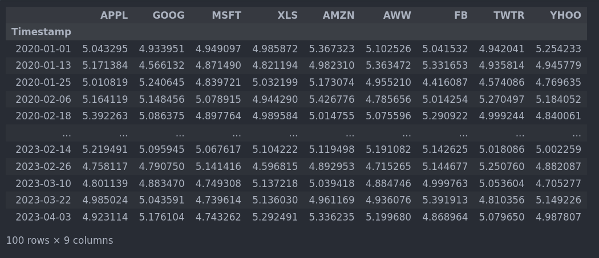
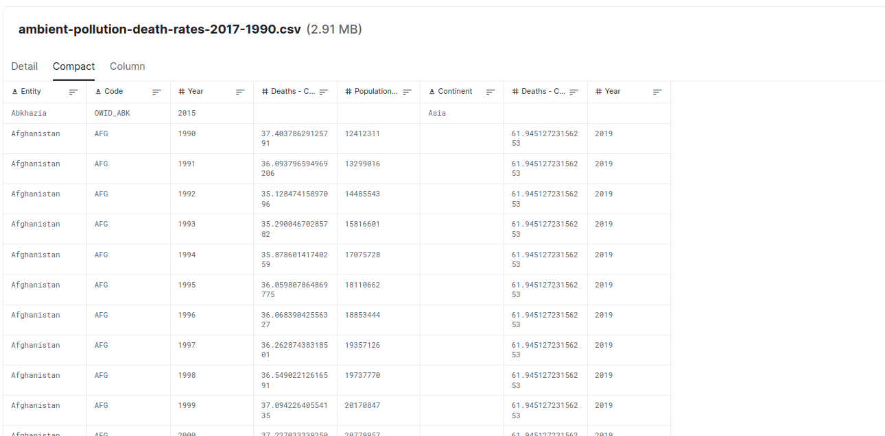

# Bodhi: Agent Based Modelling Library


After wasting my time for the last 6 hours trying to figure out some kind of design, I'm realizing that I didn't really go in with a plan. Therefore, I'm wasting with writing software. I'm going to spend the next two to three hours writing a design document that explicitly describes both the rationale and design of the library in question.


## Overview

Bodhi is supposed to be an easier way to have scalable agent-based modeling software. The purpose is to allow users to compose complex highly scalable environments like they would a PyTorch, Mesa, and Gym program, yet be able to instantly scale and provide logs to an outside system. 

Normally, one has to use an entity component system to generate scalable agent-based modeling software. While it does solve a lot of inherent problems with coupling parts of code to each other, it feels less intuitive to develop software than writing simple OOP style software. The goal is to allow the user to define simple objects (behaviors, states, context, resources) hierarchically, then run desired logic like a OpenAI Gym.

<!-- , I want to be able to simply declare objects within one  -->

### Intent

Use metaprogramming to make scalable environments while having imperative programming.

### Problem 

When creating an OpenAI gym or Mesa application clashes with the scalable methods of ECS systems. The best way to do this is to 

The `Env` is usually declared as a `world` object. Logic to push the environment forward is usually done using the `step` function. On that step, a scheduler runs through and executes the step command on each agent. The scheduler returns each agent, the state is updated each agent's step function. Hash.ai, a well-designed agent-based modeling system (I'll likely use at some point), has states and behaviors defined separately from each other. This is a decoupled approach that allows for scalable environments. There's an issue with this approach. **Cohesion and strategic coupling is missing, dynamically controlling behavior on agents and environments are not supported, and tight integration with python's many libraries is not immediately available without jumping through extra steps**. 

This can be problematic when we want to have an entity that has private methods. If we want to create systems and entities without using the agent interface directly. The setup also makes it hard to use type inference on objects. This could be something we would want for safety. I want to be able to have the scalability and native logging as hash.ai does, while still maintaining high python compatibility.


## Requirements

1. High-speed
2. Compatibility with an online system.
3. Compatibility with OpenAI gym.
4. Python definition of agents, support classes, and behaviors (Python ecosystem bro)
5. Instant logging and reporting of events, messages, and states.
6. Support for structured network management.
7. Configurations defined in a single place.
   1. Preferably updating the configuration online (if possible)

### Solution Exploration

#### Notes to Consider

1. Manipulating information dynamically can be done with a vertical table. Though one should be weary of doing so.
2. Can go distributed using Ray and Hazelcast. Would do best to try coming up with your own server. It would limit processing speed at some point, but would allow for a scalable design.

#### GDScript

I want to start with GDScript. It's close to Python in style, and it works with a game engine. This is a player shooting example on GDScript.


```py
extends Sprite

signal shoot(bullet, direction, location)

var Bullet = preload("res://Bullet.tscn")

func _input(event):
    if event is InputEventMouseButton:
        if event.button_index == BUTTON_LEFT and event.pressed:
            emit_signal("shoot", Bullet, rotation, position)

func _process(delta):
    look_at(get_global_mouse_position())

```

The main scene then receives the signal from the player object (above), and sends an object on the trajectory with the given direction.

```py
func _on_Player_shoot(Bullet, direction, location):
    var b = Bullet.instance()
    add_child(b)
    b.rotation = direction
    b.position = location
    b.velocity = b.velocity.rotated(direction)

```

This showcases a couple of things:

1. Player instance that is always accessible.
2. Signals that can be called by name and propagated to any object listing to the signal.
3. Adding instances to the game/simulation.
4. Changing state of the new instance on create.

This is a beautiful way of thinking. While I could think about my problems using ECS, this would help me think about issues in terms of scenes. GDscript has many other capabilities, like `get_node(node_name)`, and `get_reference(object_name)`.


#### Native Logging Capability

SQLModel uses Pydantic to work. It maps field properties of each class type a corresponding variable. For a given class with the right type, I could set variables on an attribute, and it would send the value to the database in the background on `__setattribute__`. 
```py
from svm.core.store import set_attribute

class Commons(Module, store=True):
    value1: str
    value2: int
# This would be used to set the context of a given episode
with set_context(episode='saksjkajsklas'):
    commons = Commons(value1="something", value2=value2)

```


```py
def __setattr__(self, name, value):
    config = getattr(self, '__config__', False)
    if config:
        if getattr(config, 'store', False):
            # We would set the episode here
            set_attribute(self, name, value, episode=get_episode()) # self has name and module_id. module_id would be the same as agent_id with agents.
```

Get attribute could look up the latest attributes for a given class and item. Otherwise, it would return the default attribute.

### Accessing Context

Damn dude, I just realized how important context is for an environment. I need to be able to access variables between parts of the program. Perhaps we could do something like godot and use a function like `get_context()`. 
```py
network = self.get_context('network')
```

If I need to call resources before and after a step function I could do something like:

```py
time = self.get_resource('time')
```

### 

## Solution
```py

class BondingCurve(Module):
    reserve: float
    supply: float
    kappa: float
    invariant: Optional[float] = None
    _has_init: bool = PrivateAttr(False)

    def __post_init__(self):
        self.invariant = invariant(reserve=self.reserve, supply=self.supply, power_invariant=kappa)


    def deposit(self, dai: float, current_reserve: float, current_token_supply: float):
        # Returns number of new tokens minted, and their realized price
        tokens, realized_price = mint(
            dai, current_reserve, current_token_supply, self.kappa, self.invariant
        )
        return tokens, realized_price

    def burn(
        self,
        tokens_millions: float,
        current_reserve: float,
        current_token_supply: float,
    ):
        # Returns number of DAI that will be returned (excluding exit tribute) when the user burns their tokens, with their realized price
        dai, realized_price = withdraw(
            tokens_millions,
            current_reserve,
            current_token_supply,
            self.kappa,
            cast(float, self.invariant),
        )
        return dai, realized_price

    def get_token_price(self, current_reserve: float):
        return spot_price(current_reserve, self.kappa, self.invariant)

    def get_token_supply(self, current_reserve: float):
        return supply(current_reserve, self.kappa, self.invariant)


class AgentGym(gym.Gym, Module, ABC):
    def __init__(self, *args):
        super().__init__(*args)
        
    
    def reset(self, params: dict = {}):
        bonding: BondingCurve = self.get_component('bonding_curve')
        
        bonding.history(50) # get dataframe of last 50 steps for component


    def step(self, input: Any):
        pass


```

---


## Extended Notes - More on design and implementation tips

Before going on a tangent, know that you should do interface-based coding more often. **Continuing the original message...**

Jamboree and **Prisma Python** have a huge number of sources to draw upon. I didn't realize how much better I was then than I am now. It's probably a major wake up call. I think the lack of sleep and socialization has hurt me, and I need to change habits. That said:


<h1 style="text-align:center;">Jamboree is fucking awesome!!!</h1>

The implementation is lacking in many ways, but I know how to fix the issues. The database actions is the most amazing part. I know what kinds of outcomes I want to achieve through creating a interface fist, I can take my time thinking about the specific implementation.

The Module class was missing fundamental `actions`. Some example actions include `create`, `create_many`, `find_unique`, `find_first`, `find_many`, `count`, etc.:

These actions will allow me to do everything else regarding module and agent-based modeling systems. I'm going to think of some clear goals, and write them below:

### Agent-Based Modeling System Goals

1. Be able to create a portfolio that tracks a resampled price of a basket of currency.
2. Dynamic Object-Oriented and Composition focused system that allows new users to create a high-scale traading Agent in 10 minutes.
3. Allow people to create a high-scale SugarScape game within 20-minutes.
4. Max **5ms** queries to arrow -> polars/dataframe conversion for most systems.
6. Let people easily add, and manipulate a scalable graph with a simple `dict` and operator-focused ORM in minutes.
7. Setup a trading RL environment (like with Adam and TT) in a Day.
8. Get 3000 stars on GitHub.
9. Have 12 getting started tutorials that take 10 minutes to give people benefits.
   1. Have provable ways to increase productivity and monetary abundance.
10. 20000 follows from Produced Work.
   2. Will require scheduling out 20 threads over 3 weeks. Will focus only on that in mid-September.
11. Start collaboration with 10 professors.
12. Unleash 3 weeks of daily idea practice while finishing up code.
13. Hang around a University for 4 days a week towards the end of the development.


The big challenge is with coming up with a way forward.

### How to reach goals

#### Personal Notes:

I need to grow my health and relearn my skills again. That's a priority. That will allow me to think better (clearer and more flexible), and reach the goals above. I will have to start growing my brain again starting tomorrow. A good idea would be to get rid of Adderall. I can't instantly quit stimulants, I can switch to LSD, Ayahuasca (microdose), and periodically Addy until I can lean off entirely.  The added neural plasticity will allow me to drop the psychological dependence and learn new things. The added creativity, flow (via exercising and ideas), and enhanced skill will allow me to work more effectively.


### Framework Features and Goals

1. Have a resource access modeling framework.
   1. Already started
2. **A write-through module design for the attributes.**
   1. Like `SQLModel`, but with a background framework.
3. Adopt the **`server`** concept from Godot Engine.
4. Add model save hooks to each model.
5. Call those save hooks within a `__call__` method.
6. **Behavior ordering and configuration like with PyTorch.**
7. Turn `Network` and Time into a resource that sends information into the background to be processed further. Turn it into a thread-safe `asyncio` compatible resource (like the `enqueue` option in `loguru`), and send tasks to it.
   1. It might be a good idea to have a small group of actors that receive information from a queue and save that information in the background.
8. **DataFrame Views (interfaces)** - Move data from the database quickly to an arrow-derived DataFrame.


#### Module Forward Example

Showcasing how people would define models and create feedforward Models/Modules.


```py
# 


# This would be something more complex than BaseModel
class ForwardPayload(BaseModel): 
    state_model: BaseState | None = None
    
    def distill_state(self, parent: Module):
        """State models give behaviors the ability to access parent module's properties without directly giving access to the parent module???

        I could also just pass a parent directly to items within the forward/behave functions.
        """
        self.state_model = parent.distill_state()

    def dict(self):
        return {}
    
    def model(self):
        pass

    def vector(self):
        return torch.tensor([])

    def tensor(self):
        return torch.tensor([[[1, 2, 3, 4]]])

    
    def state(self):
        return self.state_model
    

    

class Bank(Entity):

    def __init__(self):
        # A good example would be handing out a loan from people that are looking for one, or acting on existing loans.
        self.test_behave = TestBehavior()
        self.test_behave2 = TestBehavior2()
    


    # We would add the current module state to the payload 
    # `After` hooks would update the current module state to reflect the changes made from behaviors class.
    def forward(self, payload: ForwardPayload):

        """
            For entity/module/agents we pull from a list of uncalled instances given an episode
            Could be hidden within hooks. The hooks are going to be in the `__call__` and  function.
            Behave and forward are the same thing. Check for equality, set, or imbalance. 
            >>> # The normal behavior looks like this without changing the order of the behaviors.
            >>> # We're able to change the order because of this function.
            >>> state = self.test_behave(payload.state())
            >>> state = self.test_behave2(state)
        """

        # This would be the default behaviour. Though we can also change the order and add logic in between.
        state = self.test_behave2(payload.state())
        state = self.test_behave(state)
        return payload

    def behave(self, payload: ForwardPayload)
        return self.forward(payload)

```


### Pre-built Queries (Based on Requirements)

Should go in knowing how data will be used.

```py
class SampleEnvHandler(DBHandler):
    """Abstract handler that we use to keep track of information.
    """

    def __init__(self, **kwargs):
        super().__init__()
        self.entity = "sample"
        self.required = {
            "episode": str
        }
        self._balance = 0
        self._limit = 100

    @property
    def limit(self):
        return self._limit

    @limit.setter
    def limit(self, limit):
        self._limit = limit

    @property
    def balance(self):
        """ Gets the sum of the last three values at set the value """
        return self._balance

    @property
    def transactions(self)->vaex.dataframe:
        """ Get the last 100 transactions """
        many_records = self.many(self.limit)

        if isinstance(many_records, dict):
            frame = pd.DataFrame(many_records)
            transactions_frame = vaex.from_pandas(frame)
            return transactions_frame.sort('timestamp', ascending=False)

        if len(many_records) > 0:
            frame = pd.DataFrame(many_records)
            transactions_frame = vaex.from_pandas(frame)
            return transactions_frame.sort('timestamp', ascending=False)

        return vaex.from_pandas(pd.DataFrame())

    def save_update_recent(self, data:dict):
        transactions = self.transactions
        count = transactions.count()
        new_value = data['value'] + count
        data['value'] = int(new_value)
        super().save(data)

def flip(n=0.02):
    if n >= random.uniform(0, 1):
        return True
    return False

```

### Common DataFrame examples:

#### Portfolio-Like Dataframe



Technical analysis has the same tabular representation.




Data will also have hierarchies, categories, and topological structures. Long-term data will incorporate interactions


## Requirements


1. Must be able to load a single Dataframe for the attributes on a single model. (will have example below).
2. Must be able to load the most recent state of a given module (i.e. Agent, Entity, Behavior, Resource, Contracts, etc.)
3. Get the latest state from the simulation's current time.
4. There are two different kinds of access:
   1. Latest state from simulation time.
   2. Latest state from atomic time.
5. Get the absolute last added event to the model with the episode and ID.
6. Add hooks to the model that save and load the Module's state on `__call__` or `step`. 
   1. The hooks would ensure that we're getting the right information for a given type of module.
7. Must have standard `serialization` and `deserialization` methods to move the data (replacing `__getitem__` and `__setitem__`).
   1. It's to ensure we don't run into a pickling/thread serialization issue.
8. Must be able to get related information models DataFrame.
9. Must get one an unprocessed randomly get list of agents (like in current implementation of Mesa). 
10. Create graph connections via specialized operations.


# **Design Examples**

Examples of desired designs. Missing a lot of implementation details to get the full picture across.

## **Serialization / Deserialization calls**

Serialization inspired by PyTorch Modules.

```python
def __getstate__(self):
    # Get the current state
    # Then filter it to avoid thread lock incompatibilities
    unfiltered_state = self.__dict__
    ...

    return 
...

def __setstate__(self, state):
    self.__dict__.update(state)
    # Support loading old checkpoints that don't have the following attrs:
    if '_forward_pre_hooks' not in self.__dict__:
        self._forward_pre_hooks = OrderedDict()
    if '_state_dict_hooks' not in self.__dict__:
        self._state_dict_hooks = OrderedDict()
    if '_load_state_dict_pre_hooks' not in self.__dict__:
        self._load_state_dict_pre_hooks = OrderedDict()
    if '_load_state_dict_post_hooks' not in self.__dict__:
        self._load_state_dict_post_hooks = OrderedDict()
    if '_non_persistent_buffers_set' not in self.__dict__:
        self._non_persistent_buffers_set = set()
    if '_is_full_backward_hook' not in self.__dict__:
        self._is_full_backward_hook = None

```

**Notes:**

* Can use the [dill package to detect unserializable](https://stackoverflow.com/questions/17872056/how-to-check-if-an-object-is-pickleable) objects ... maybe ... Go with a depth of 1?? Might be better to just have a whitelist.
* Don't forget to [add **`__slot__`** objects](https://stackoverflow.com/questions/1939058/simple-example-of-use-of-setstate-and-getstate/41754104#41754104). They might be missing from the **`__dict__`** method.

## Deal with DataFrames and Relationships

Getting a DataFrame for a given module's history touches upon querying and model relationships as a whole. A module will contain other modules. Those modules also have their own states. Ultimately, those modules will contribute their state to their parent module. 

Actually, here's a set of question:

1. Would I include submodules as relationships?
2. If so, when would I consider it count?
   1. Is there some kind set of rules I need to apply to modules? (similar to PyTorch)
3. Would I select historical records by using some ORM-like selection from within the module?
4. The answer to the first question is yes, but not always.
5. 

Thank the sweet lord almighty. I happened to look at one of three remaining sources and believe I figured out how to structure the code. While I'll still take inspiration from my predecessors. The style is straightforward and borrowed from [PieCash](https://github.com/sdementen/piecash/blob/ec30cf469198cccf35f7ba968f889d360cfe1824/piecash/core/account.py#L169). They do a really good job of using python features to clean it up.

```py
# 
root_account_guid = Column(
    "root_account_guid",
    VARCHAR(length=32),
    ForeignKey("accounts.guid"),
    nullable=False,
)
root_template_guid = Column(
    "root_template_guid",
    VARCHAR(length=32),
    ForeignKey("accounts.guid"),
    nullable=False,
)

# relation definitions
root_account = relation(
    "Account",
    # back_populates='root_book',
    foreign_keys=[root_account_guid],
)
root_template = relation("Account", foreign_keys=[root_template_guid])

uri = None
session = None

# link options to KVP
use_trading_accounts = kvp_attribute(
    "options/Accounts/Use Trading Accounts",
    from_gnc=lambda v: v == "t",
    to_gnc=lambda v: "t",
    default=False,
)

placeholder = mapped_to_slot_property(
_placeholder,
slot_name="placeholder",
slot_transform=lambda v: "true" if v else None,
)

# relation definitions
commodity = relation("Commodity", back_populates="accounts")
children = relation(
    "Account",
    back_populates="parent",
    cascade="all, delete-orphan",
    collection_class=CallableList,
)
parent = relation(
    "Account",
    back_populates="children",
    remote_side=guid,
)
splits = relation(
    "Split",
    back_populates="account",
    cascade="all, delete-orphan",
    collection_class=CallableList,
)
lots = relation(
    "Lot",
    back_populates="account",
    cascade="all, delete-orphan",
    collection_class=CallableList,
)
budget_amounts = relation(
    "BudgetAmount",
    back_populates="account",
    cascade="all, delete-orphan",
    collection_class=CallableList,
)
scheduled_transaction = relation(
    "ScheduledTransaction",
    back_populates="template_account",
    cascade="all, delete-orphan",
    uselist=False,
)
```

Notice how instruments are defined. They're defined by both a type and set on call. We would set the actual inital values of modules within the `reset` function. 

```py
from svm.core import Payload

# An alternative to this implementation is to use the Entity class. The entity class would inherit from a super type where there needs to be an identity attached before moving forward. In tensortrade that's called a Indentifiable.
class Portfolio(Module):
    # Price is a type of module. It has multiple states that are saved for a given time. 
    # State that there are multiple prices for a given portfolio
    initial_balance: float
    initial_net_worth: float | None = None
    
    base_instrument: Instrument = Instrument(related=True)
    instruments: Instrument = Instrument(related=True, many=True)
    
    def __init__(self, **kwargs):
        # Realizing I might need to change how certain modules are run. I would likely exclude modules that match certain criteria.
        # Would need to add a default method to modules. Would be like a component class.
        self.base_instrument = self.default('initial_currency')
        self.initial_balance = self.default('initial_balance')


    
    
    
    def balance(self, instrument: Instrument):
        pass

    def locked_balance(self, instrument: Instrument):
        pass

    def total_balance(self, instrument: Instrument):
        pass


    def step(self, data: Payload):
        # Figured out how to wrap this object.
        pass
    
    def reset(self) -> None:
        """Resets the portfolio."""
        self._initial_balance = self.base_balance
        self._initial_net_worth = None
        self._net_worth = None
        self._performance = None

        self.ledger.reset()
        for wallet in self._wallets.values():
            wallet.reset()


```
## Graph Network

To manage in depth graph connections I figure there will be a combination of techniques. One part would be the use of operators and objects. It would look like the following:

```py
from svm.framework import graph as gl

user = User(id='161ec184-86b5-4987-b183-4ea06150544e', name='Jimmy Saul', email='jimmy720@gmail.com').save()

book = Book(id='fef25e46-409d-486a-81ac-c238dd2a569b', name='The Passion', price=23.55).save()


# Uses keyword args to add graph attributes
# Eager creation of an edge with two existing nodes. If they don't already exist, lazily wait to create them.

user >> gl.link('read', timestamp='-400H', attr2='value2', ...) >> book
user >> gl.link('sold', price=19.20, timestamp='-20H') >> book


```

Would create complex queries by using an internal DSL.

```py
from dotmotif import Motif, GrandIsoExecutor

executor = GrandIsoExecutor(graph=my_networkx_graph)

triangle = Motif("""
A -> B
B -> C
C -> A
""")

results = executor.find(triangle)
```

This can also be replaced using a symbolic system.

```py
from svm.framework import graph as gl
 
A, B, C = gl.symbol(['A', 'B', 'C'])

# The language probably take priority.
triangle = A >> B >> C >> A
results = executor.find(triangle)
```

**Notes:**

* Some other possibilites include GNNs, and [Neural Symbolic queries](https://github.com/DeepGraphLearning/GNN-QE). Would be cool to have, not necessarily the most important thing right now.


## Helpful Projects:

`Hazelcast` will shortcut the creation of the distributed cache system. Can't mess with it immediately due to overhead.

1. https://hazelcast.readthedocs.io/en/stable/serialization.html
2. https://hazelcast.readthedocs.io/en/stable/api/proxy/cp/atomic_reference.html
3. https://arrow.apache.org/docs/python/memory.html
4. https://arrow.apache.org/docs/python/plasma.html#using-plasma-with-huge-pages
